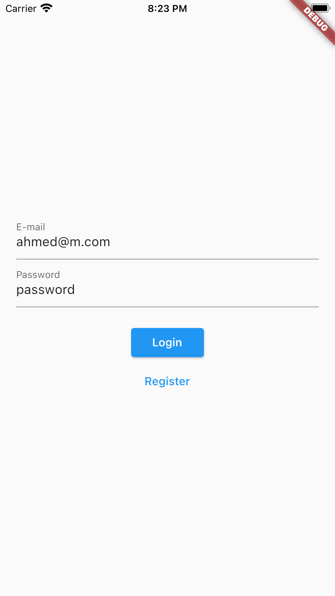
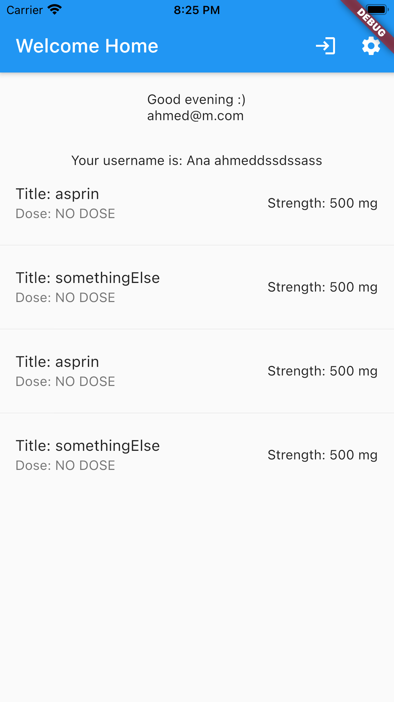

# Code Task

A new simple Flutter project.

## Features
* Login (Firebase).
* Register.
* Unit Tests (Covers 80%).
* Network Calls.
* JSON parsing.
* State Managment (Provider).

## Screenshots

 

## Unit Testing Resources
* [Testing Flutter Apps - Making Sure Your Code Works](https://www.youtube.com/watch?v=bj-oMYyLZEY)
* [Testing Flutter apps](https://flutter.dev/docs/testing)
* [An introduction to unit testing](https://flutter.dev/docs/cookbook/testing/unit/introduction)
* [Effective Unit Testing by Eliotte Rusty Harold](https://www.youtube.com/watch?v=fr1E9aVnBxw)

## Getting Started

This project is a starting point for a Flutter application.

A few resources to get you started if this is your first Flutter project:

- [Lab: Write your first Flutter app](https://flutter.dev/docs/get-started/codelab)
- [Cookbook: Useful Flutter samples](https://flutter.dev/docs/cookbook)

For help getting started with Flutter, view our
[online documentation](https://flutter.dev/docs), which offers tutorials,
samples, guidance on mobile development, and a full API reference.
